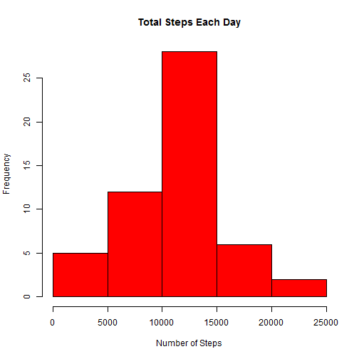
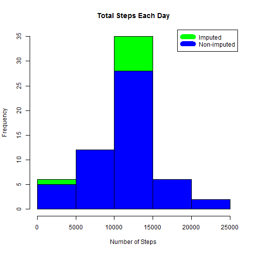
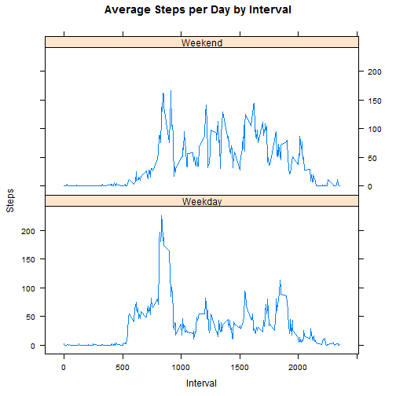

Gautam Somappa  
11th July 2015  

##Summary  
It is now possible to collect a large amount of data about personal movement using activity monitoring devices such as a Fitbit, Nike Fuelband, or Jawbone Up. These type of devices are part of the "quantified self" movement - a group of enthusiasts who take measurements about themselves regularly to improve their health, to find patterns in their behavior, or because they are tech geeks. But these data remain under-utilized both because the raw data are hard to obtain and there is a lack of statistical methods and software for processing and interpreting the data.    

This assignment makes use of data from a personal activity monitoring device. This device collects data at 5 minute intervals through out the day. The data consists of two months of data from an anonymous individual collected during the months of October and November, 2012 and include the number of steps taken in 5 minute intervals each day.

When you click the **Knit** button a document will be generated that includes both content as well as the output of any embedded R code chunks within the document. You can embed an R code chunk like this:  

##Assignment    
###What is mean total number of steps taken per day?  


```r
data<-read.csv("activity.csv")
temp<-subset(data,na.rm=FALSE)
steps_by_day <- aggregate(steps ~ date, data, sum)
hist(steps_by_day$steps, main = paste("Total Steps Each Day"), col="red", xlab="Number of Steps")
```

 

```r
rmean <- mean(steps_by_day$steps)
rmean
```

```
## [1] 10766.19
```
###What is the average daily activity pattern    

```r
steps_by_interval <- aggregate(steps~interval,data,mean)  

plot(steps_by_interval$interval,steps_by_interval$steps, type="l", xlab="Interval", ylab="Number of Steps",main="Average Number of Steps per Day by Interval")
```

 

```r
max_interval <- steps_by_interval[which.max(steps_by_interval$steps),1]
```
The 5-minute interval, on average across all the days in the data set, containing the maximum number of steps is 835  

###Imputing missing values  

Missing data needed to be imputed. Only a simple imputation approach was required for this assignment. Missing values were imputed by inserting the average for each interval. Thus, if interval 10 was missing on 10-02-2012, the average for that interval for all days (0.1320755), replaced the NA.  


```r
incomplete <- sum(!complete.cases(data))
imputed_data <- transform(data, steps = ifelse(is.na(data$steps), steps_by_interval$steps[match(data$interval, steps_by_interval$interval)], data$steps))
imputed_data[as.character(imputed_data$date) == "2012-10-01", 1] <- 0
steps_by_day_i <- aggregate(steps ~ date, imputed_data, sum)
hist(steps_by_day_i$steps, main = paste("Total Steps Each Day"), col="green", xlab="Number of Steps")

#Create Histogram to show difference. 
hist(steps_by_day$steps, main = paste("Total Steps Each Day"), col="blue", xlab="Number of Steps", add=T)
legend("topright", c("Imputed", "Non-imputed"), col=c("green", "blue"), lwd=10)
```

 
Calculate new mean and median for imputed data.  

```r
rmean.i <- mean(steps_by_day_i$steps)
rmedian.i <- median(steps_by_day_i$steps)
```
Calculate difference between imputed and non-imputed data.

```r
mean_diff <- rmean.i - rmean
total_diff <- sum(steps_by_day_i$steps) - sum(steps_by_day$steps)
```
1.The imputed data mean is 1.059 × 104  
2.The difference between the non-imputed mean and imputed mean is -176.4949  
3.The difference between the non-imputed mean and imputed mean is 1.1887  
4.The difference between total number of steps between imputed and non-imputed data is 7.5363 × 104. Thus, there were 7.5363 × 104 more steps in the imputed data.   

###Are there differences in activity patterns between weekdays and weekends?  


```r
weekdays <- c("Monday", "Tuesday", "Wednesday", "Thursday", 
              "Friday")
imputed_data$dow = as.factor(ifelse(is.element(weekdays(as.Date(imputed_data$date)),weekdays), "Weekday", "Weekend"))

steps_by_interval_i <- aggregate(steps ~ interval + dow, imputed_data, mean)

library(lattice)

xyplot(steps_by_interval_i$steps ~ steps_by_interval_i$interval|steps_by_interval_i$dow, main="Average Steps per Day by Interval",xlab="Interval", ylab="Steps",layout=c(1,2), type="l")
```

 
